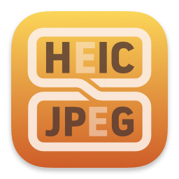
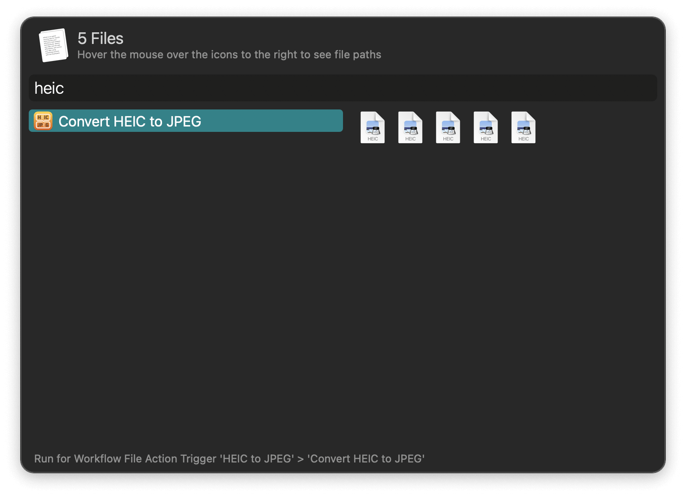
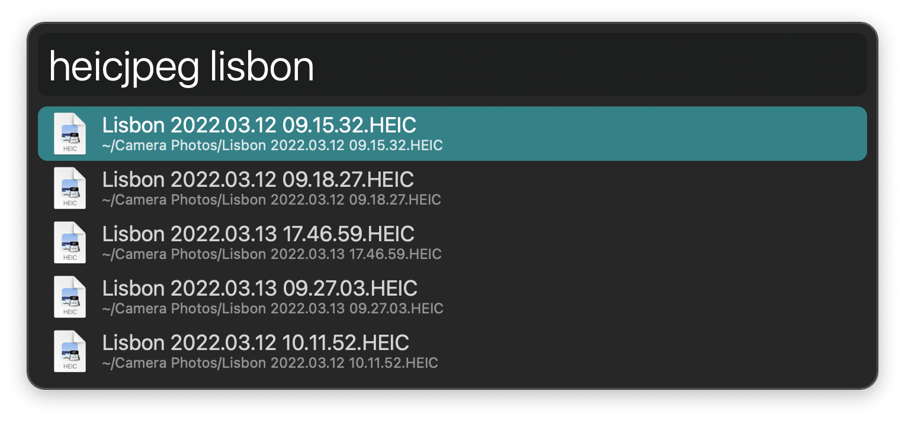

#  HEIC to JPEG Alfred Workflow

Convert .heic images to .jpeg

[⤓ Install on the Alfred Gallery](https://alfred.app/workflows/alfredapp/heic-to-jpeg)

## Usage

Convert HEIC images to JPEG via the [Universal Action](https://www.alfredapp.com/help/features/universal-actions/).

Alternatively, find images with the `heicjpeg` keyword.

JPEGs are saved to the `Save Folder` set in the [Workflow’s Configuration](https://www.alfredapp.com/help/workflows/user-configuration/) but you can immediately move them to another destination by choosing `Move to New Location` in the `After Conversion` configuration. Other options include showing a notification, revealing files in the Finder, and appending to the [File Buffer](https://www.alfredapp.com/help/features/file-search/#file-buffer).

The workflow will avoid overwriting any existing files, opting to stop rather than replace data.
